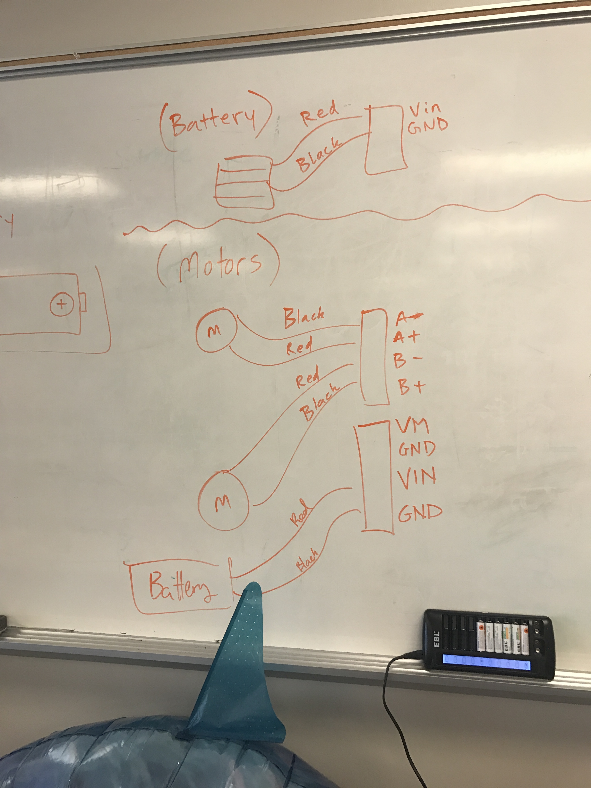

# Robot Camp Day 1 Notes

## Introduction to camp.

### Purpose of camp:

* Create a robot swarm.
* Teach the importance of building a robot one at a time.

### Questions:

* How many people have programmed before?:

12

* How many people haven't programmed before?:

2

* Different programming languages used:

construct, scratch, tinker, python minstorm, hopscotch, robocell, vex robotics, minecraft

### Safety:

* Crossing the wrong cable kills the robot.

### Options to choose from

* Crimson bots:
use python, advanced.

* AirSwimmers:
use fins for movement, left, right, up and down.

* Plotter:
draws out images with a pen, day to build, half day to adjust.

## Crimson Bots.

### Robot recycling example:

* Programming bugs don't allow robot to behave the way you want it to.
* Be specific with your instructions.
* You have to know the instructions that need to be given to the robot.

### ESP8266:

* Board.
* Don't bend pins.
* Only put wheels and motors on first.
* Battery power wires face the ESP.
* Build is different from the blueprint.
* Don't wire through the middle hole.
* Velro is better than screws

* Battery wiring: red wire goes to VIN, and black wire goes to GND.
* Flat side of battery always goes to the spring of the battery pack.

* ESP wiring: black = A-, red = A+, red = B-, black = B+.

* Small screwdrivers strip screws, use green ones.

### Terminal:

* Bottom right of screen.
* Black window with `>_` icon.

| Command | Description |
| ------- | ----------- |
|`cms` | command opens a graphic that says "cloudmesh".
| `cms robot welcome`| displays a graphic of R2D2 and C3PO.
|`cms robot probe` |displays the MAC address and TTY of the robots.
| `cms robot help` | displays a help menu  
| `cms robot image fetch` | fetches the image to be flashed on ESP8266.
| `cms robot flash erase` | erases the preexisting image on ESP8266.
| `cms robot flash python` | flashes python on to the ESP8266.
| `cms robot login` | logs into picocom.
| `cd github` | enters gitub directory in terminal from `~home`
| `cd cloudmesh.robot` | enters cloudmesh.robot from the github directory.
| `git pull` | does a github pull into a local directory.
| `cd ESP8266` | enters the ESP8266 directory from cloudmesh.robot.
| `ls` | lists items in a directory from terminal.
| `cms robot credentials set` | allows network credentials to be set on an ESP8266. Credentials will not be set on the ESP8266 if you're logged into picocom in another window. |
|`cms robot put cred` | assigns preset credentials to ESP8266.

### Robot GUI.

* IP addresses are used as the URL for the HTML GUI for the car robots.
* Buttons displayed move the robot in the direction assigned to each button.