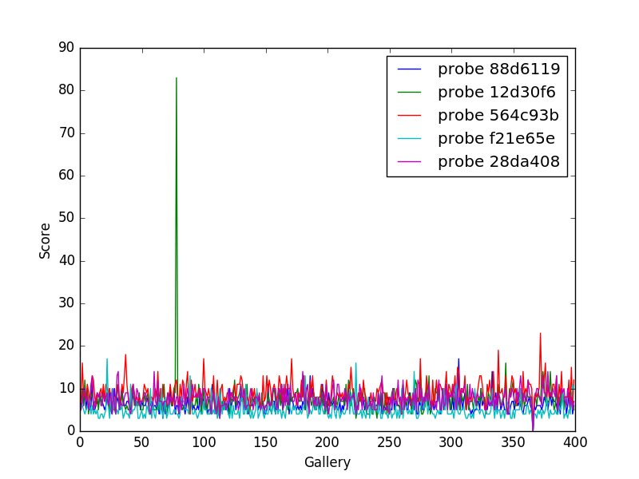

Introduction
============

Python is an easy-to-use language for running data analysis. To
demonstrate this, we will implement one of the NIST Big Data Working
Group case studies: matching fingerprints between sets of probe and
gallery images.

In order for this to run, you'll need to have installed the `NIST
Biometric Image Software
(NBIS) <http://www.nist.gov/itl/iad/ig/nbis.cfm>`__ and Sqlite3. You'll
also need the Python libraries ``numpy``, ``scipy``, ``matplotlib``.

The general application works like so:

#. Download the dataset and unpack it
#. Define the sets of probe and gallery images
#. Preprocess the images with the ``mindtct`` command from NBIS
#. Use the NBIS command ``bozorth3`` to match the gallery images to each
   probe image, obtaining an matching score
#. Write the results to an sqlite database

This is a literate python script written in Emacs Org-Mode. When making
changes, edit org-mode file, not the tangle (generated) file.

To tangle, open org-mode file in Emacs, execute ``C-c C-v t``. If you
are reading the tangled file you can jump back to the corresponding
definition in the literate file by using ``C-u C-c C-v t``. The RST form
was generated from org-mode file by ``pandoc``.

To begin with, we'll define our imports.

First off, we use the print function to be compatible with Python 3

.. code:: python

    from __future__ import print_function

Next, we'll be downloading the datasets from NIST so we need these
libraries to make this easier:

.. code:: python

    import urllib
    import zipfile
    import hashlib

We'll be interacting with the operating systems and manipulating files
and their pathnames.

.. code:: python

    import os.path
    import os
    import sys
    import shutil
    import tempfile

Some general usefull utilities

.. code:: python

    import itertools
    import functools
    import types

Using the ``attrs`` library provides some nice shortcuts to define
featurefull objects

.. code:: python

    import attr

We'll be randomly dividing the entire dataset, based on user input, into
the probe and gallery sets

.. code:: python

    import random

We'll need these to call out to the NBIS software. We'll also be using
multiple processes to take advantage of all the cores on our machine.

.. code:: python

    import subprocess
    import multiprocessing

As for plotting, we'll use ``matplotlib``, though there are many other
alternatives you may choose from.

.. code:: python

    import matplotlib.pyplot as plt
    import pandas as pd
    import numpy as np

Finally, we'll write the results to a database

.. code:: python

    import sqlite3

Utility functions
=================

Next we'll define some utility functions.

.. code:: python

      def take(n, iterable):
          "Returns a generator of the first **n** elements of an iterable"
          return itertools.islice(iterable, n )

      def zipWith(function, *iterables):
          "Zip a set of **iterables** together and apply **function** to each tuple"
          for group in itertools.izip(*iterables):
              yield function(*group)

      def uncurry(function):
          "Transforms an N-arry **function** so that it accepts a single parameter of an N-tuple"
          @functools.wraps(function)
          def wrapper(args):
              return function(*args)
          return wrapper

      def fetch_url(url, sha256, prefix='.', checksum_blocksize=2**20, dryRun=False):
          """Download a url.

          :param url: the url to the file on the web
          :param sha256: the SHA-256 checksum. Used to determine if the file was previously downloaded.
          :param prefix: directory to save the file
          :param checksum_blocksize: blocksize to used when computing the checksum
          :param dryRun: boolean indicating that calling this function should do nothing
          :returns: the local path to the downloaded file
          :rtype: 

          """

          if not os.path.exists(prefix):
              os.makedirs(prefix)

          local = os.path.join(prefix, os.path.basename(url))

          if dryRun: return local

          if os.path.exists(local):
              print ('Verifying checksum')
              chk = hashlib.sha256()
              with open(local, 'rb') as fd:
                  while True:
                      bits = fd.read(checksum_blocksize)
                      if not bits: break
                      chk.update(bits)
              if sha256 == chk.hexdigest():
                  return local

          print ('Downloading', url)

          def report(sofar, blocksize, totalsize):
              msg = '{}%\r'.format(100 * sofar * blocksize / totalsize, 100)
              sys.stderr.write(msg)

          urllib.urlretrieve(url, local, report)

          return local

Dataset
=======

We'll now define some global parameters.

First, the fingerprint dataset.

.. code:: python

    DATASET_URL = 'https://s3.amazonaws.com/nist-srd/SD4/NISTSpecialDatabase4GrayScaleImagesofFIGS.zip'
    DATASET_SHA256 = '4db6a8f3f9dc14c504180cbf67cdf35167a109280f121c901be37a80ac13c449'

We'll define how to download the dataset. This function is general
enough that it could be used to retrieve most files, but we'll default
it to use the values from above.

.. code:: python

      def prepare_dataset(url=None, sha256=None, prefix='.', skip=False):
          url = url or DATASET_URL
          sha256 = sha256 or DATASET_SHA256
          local = fetch_url(url, sha256=sha256, prefix=prefix, dryRun=skip)

          if not skip:
              print ('Extracting', local, 'to', prefix)
              with zipfile.ZipFile(local, 'r') as zip:
                  zip.extractall(prefix)

          name, _ = os.path.splitext(local)
          return name

      def locate_paths(path_md5list, prefix):
          with open(path_md5list) as fd:
              for line in itertools.imap(str.strip, fd):
                  parts = line.split()
                  if not len(parts) == 2: continue
                  md5sum, path = parts
                  chksum = Checksum(value=md5sum, kind='md5')
                  filepath = os.path.join(prefix, path)
                  yield Path(checksum=chksum, filepath=filepath)

      def locate_images(paths):

          def predicate(path):
              _, ext = os.path.splitext(path.filepath)
              return ext in ['.png']

          for path in itertools.ifilter(predicate, paths):
              yield image(id=path.checksum.value, path=path)

Data Model
==========

We'll define some classes so we have a nice API for working with the
dataflow. We set ``slots=True`` so that the resulting objects will be
more space-efficient.

Utilities
---------

Checksum
~~~~~~~~

The checksum consists of the actual hash value (``value``) as well as a
string representing the hashing algorithm. The validator enforces that
the algorithm can only be one of the listed acceptable methods.

.. code:: python

      @attr.s(slots=True)
      class Checksum(object):
        value = attr.ib()
        kind = attr.ib(validator=lambda o, a, v: v in 'md5 sha1 sha224 sha256 sha384 sha512'.split())

Path
~~~~

``Path`` s refer to an image's filepath and associated ``Checksum``. We
get the checksum "for free" since the MD5 hash is provided for each
image in the dataset.

.. code:: python

      @attr.s(slots=True)
      class Path(object):
          checksum = attr.ib()
          filepath = attr.ib()

Image
-----

The start of the data pipeline is the image. An ``image`` is has an id
(the md5 hash) and the path to the image.

.. code:: python

      @attr.s(slots=True)
      class image(object):
          id = attr.ib()
          path = attr.ib()

Mindtct
-------

The next step in the pipeline to to apply ``mindtct`` from NBIS. A
``mindtct`` object therefor represents the results of applying
``mindtct`` on an ``image``. The ``xyt`` output is needed for the next
step, and the ``image`` attribute represent the image id.

.. code:: python

      @attr.s(slots=True)
      class mindtct(object):
          image = attr.ib()
          xyt = attr.ib()

We need a way to construct a ``mindtct`` object from an ``image``
object. A straightforward way of doing this would be to have a
``from_image`` ``@staticmethod`` or ``@classmethod``, but that doesn't
work well with ``multiprocessing`` as top-level functions work best
(they need to be serialized).

.. code:: python

      def mindtct_from_image(image):
          imgpath = os.path.abspath(image.path.filepath)
          tempdir = tempfile.mkdtemp()
          oroot = os.path.join(tempdir, 'result')

          cmd = ['mindtct', imgpath, oroot]

          try:
              subprocess.check_call(cmd)

              with open(oroot + '.xyt') as fd:
                  xyt = fd.read()

              result = mindtct(image=image.id, xyt=xyt)
              return result

          finally:
              shutil.rmtree(tempdir)

Bozorth3
--------

The final step is the pipeline is calling out to the ``bozorth3``
program from NBIS. The ``bozorth3`` class represent the match done:
tracking the ids of the probe and gallery images as well as the match
score.

Since we'll be writing these instances out to a database, we provide
some static methods for SQL statements. While there are many
Object-Relational-Model (ORM) libraries available for Python, we wanted
to keep this implementation simpler.

.. code:: python

      @attr.s(slots=True)
      class bozorth3(object):
          probe = attr.ib()
          gallery = attr.ib()
          score = attr.ib()

          @staticmethod
          def sql_stmt_create_table():
              return 'CREATE TABLE IF NOT EXISTS bozorth3 (probe TEXT, gallery TEXT, score NUMERIC)'

          @staticmethod
          def sql_prepared_stmt_insert():
              return 'INSERT INTO bozorth3 VALUES (?, ?, ?)'

          def sql_insert_values(self):
              return self.probe, self.gallery, self.score

In order to work well with ``multiprocessing``, we define a class
representing the input parameters to ``bozorth3`` and a helper function
to run ``bozorth3``. This way the pipeline definition can be kept simple
to a ``map`` to create the input and then a ``map`` to run the program.

As NBIS ``bozorth3`` can be called to compare one-to-one or one-to-many,
we'll also dynamically choose between these approaches depending on if
the gallery is a list or a single object.

.. code:: python

      @attr.s(slots=True)
      class bozorth3_input(object):
          probe = attr.ib()
          gallery = attr.ib()

          def run(self):
              if isinstance(self.gallery, mindtct):
                  return bozorth3_from_group(self.probe, self.gallery)
              elif isinstance(self.gallery, types.ListType):
                  return bozorth3_from_one_to_many(self.probe, self.gallery)
              else:
                  raise ValueError('Unhandled type for gallery: {}'.format(type(gallery)))

      def run_bozorth3(input):
          return input.run()

One-to-one
~~~~~~~~~~

Here, we define how to run NBIS ``bozorth3`` on a one-to-one input:

.. code:: python

      def bozorth3_from_group(probe, gallery):
          tempdir = tempfile.mkdtemp()
          probeFile = os.path.join(tempdir, 'probe.xyt')
          galleryFile = os.path.join(tempdir, 'gallery.xyt')

          with open(probeFile, 'wb')   as fd: fd.write(probe.xyt)
          with open(galleryFile, 'wb') as fd: fd.write(gallery.xyt)

          cmd = ['bozorth3', probeFile, galleryFile]

          try:
              result = subprocess.check_output(cmd)
              score = int(result.strip())

              return bozorth3(probe=probe.image, gallery=gallery.image, score=score)
          finally:
              shutil.rmtree(tempdir)

One-to-many
~~~~~~~~~~~

Calling NBIS one-to-many turns out to be more efficient than the
overhead of starting a ``bozorth3`` process for each pair.

.. code:: python

      def bozorth3_from_one_to_many(probe, galleryset):
          tempdir = tempfile.mkdtemp()
          probeFile = os.path.join(tempdir, 'probe.xyt')
          galleryFiles = [os.path.join(tempdir, 'gallery%d.xyt' % i) for i, _ in enumerate(galleryset)]

          with open(probeFile, 'wb') as fd: fd.write(probe.xyt)
          for galleryFile, gallery in itertools.izip(galleryFiles, galleryset):
              with open(galleryFile, 'wb') as fd: fd.write(gallery.xyt)

          cmd = ['bozorth3', '-p', probeFile] + galleryFiles

          try:
              result = subprocess.check_output(cmd).strip()
              scores = map(int, result.split('\n'))
              return [bozorth3(probe=probe.image, gallery=gallery.image, score=score)
                      for score, gallery in zip(scores, galleryset)]
          finally:
              shutil.rmtree(tempdir)

Plotting
========

For plotting we'll operation only on the database. We'll choose a small
number of probe images and plot the score between them and the rest of
the gallery images.

.. code:: python

      def plot(dbfile, nprobes=10, outfile='figure.png'):

          conn = sqlite3.connect(dbfile)

          results = pd.read_sql("SELECT probe FROM bozorth3 ORDER BY score LIMIT '%s'" % nprobes,
                                con=conn)

          shortlabels = mk_short_labels(results.probe)

          plt.figure()

          for i, probe in results.probe.iteritems():
              stmt = 'SELECT gallery, score FROM bozorth3 WHERE probe = ? ORDER BY gallery DESC'
              matches = pd.read_sql(stmt, params=(probe,), con=conn)
              xs = np.arange(len(matches), dtype=np.int)
              plt.plot(xs, matches.score, label='probe %s' % shortlabels[i])

          plt.ylabel('Score')
          plt.xlabel('Gallery')
          plt.legend()
          plt.savefig(outfile)

The image ids are long hash strings. In order to minimize the amount of
space on the figure the labels take, we provide a helper function to
create a short label that still uniquely identifies each probe image in
the selected sample.

.. code:: python

      def mk_short_labels(series, start=7):
          for size in xrange(start, len(series[0])):
              if len(series) == len(set(map(lambda s: s[:size], series))):
                  break

          return map(lambda s: s[:size], series)

Main Entry Point
================

Puting it all together

.. code:: python

      if __name__ == '__main__':

          prefix = sys.argv[1]

          DBFILE = os.path.join(prefix, 'scores.db')
          PLOTFILE = os.path.join(prefix, 'plot.png')

          md5listpath = sys.argv[2]
          perc_probe = float(sys.argv[3])
          perc_gallery = float(sys.argv[4])

          pool = multiprocessing.Pool()
          conn = sqlite3.connect(DBFILE)
          cursor = conn.cursor()

          cursor.execute(bozorth3.sql_stmt_create_table())

          dataprefix = prepare_dataset(prefix=prefix, skip=True)

          print ('Loading images')
          paths = locate_paths(md5listpath, dataprefix)
          images = locate_images(paths)
          mindtcts = pool.map(mindtct_from_image, images)
          mindtcts = list(mindtcts)

          print ('Generating samples')
          probes  = random.sample(mindtcts, int(perc_probe   * len(mindtcts)))
          gallery = random.sample(mindtcts, int(perc_gallery * len(mindtcts)))
          input   = [bozorth3_input(probe=probe, gallery=gallery) for probe in probes]

          print ('Matching')
          bozorth3s = pool.map(run_bozorth3, input)
          for group in bozorth3s:
              vals = map(bozorth3.sql_insert_values, group)
              cursor.executemany(bozorth3.sql_prepared_stmt_insert(), vals)
              conn.commit()
              map(print, group)

          conn.close()

          plot(DBFILE, nprobes=5, outfile=PLOTFILE)

Running
=======

You can run the code like so:

.. code:: shell

      time python python_lesson1.py \
           python_lesson1 \
           NISTSpecialDatabase4GrayScaleImagesofFIGS/sd04/sd04_md5.lst \
           0.001 \
           0.1

This will result in a figure like the following

   Fingperprint Match scores
